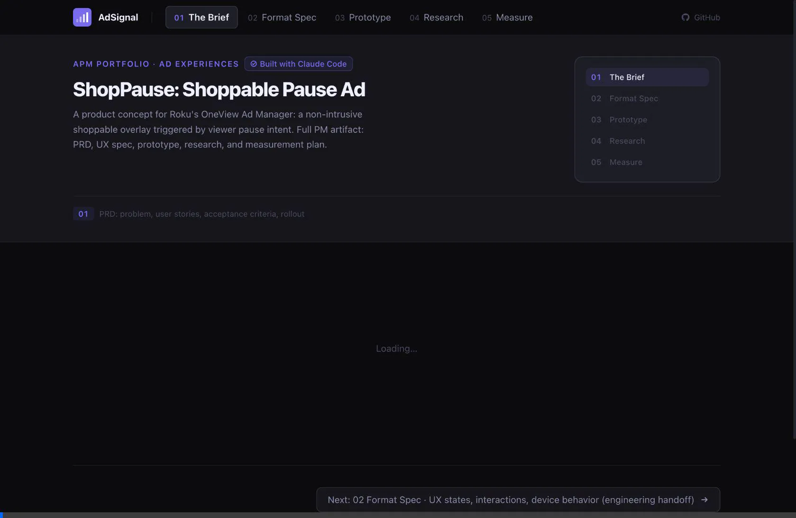

# AdSignal: ShopPause Shoppable Pause Ad

**APM Portfolio · Roku Ad Experiences**

A full product concept for Roku's OneView Ad Manager: a non-intrusive shoppable overlay triggered by viewer pause intent. Built as a complete PM artifact spanning problem discovery, product spec, interactive prototype, market research, and A/B test design.



**Live:** [ad-signal.vercel.app](https://ad-signal.vercel.app) &nbsp;·&nbsp; **Stack:** Next.js 16 · Recharts · Claude API · Vercel

---

## The product concept

**ShopPause** fills the highest-intent, lowest-friction moment in CTV that no Roku format currently captures: the viewer pause. When a viewer pauses content, they've voluntarily stopped, they're holding the remote, and they're in a reflective state. ShopPause delivers a non-intrusive shoppable product card exactly at that moment. Dismiss with one button, shop with one scan.

**Why Roku, why now:** Shoppable CTV is Roku's stated strategic priority (Shoptalk 2025). Action Ads already demonstrate 1.8–2.4% CTR at a 30% CPM premium. No major CTV platform has productized a pause-triggered shoppable format. This is a first-mover opportunity.

---

## PM artifacts

| Tab | What's inside |
|-----|---------------|
| **01 The Brief** | PRD: problem statement, user stories (US-01–03) with acceptance criteria, KPI targets, guardrail metrics, rollout plan (Alpha → Closed Beta → GA), open questions with cross-functional owners |
| **02 Format Spec** | UX state machine, remote control interaction map, device behavior matrix (Stick 4K / Roku TV / Ultra / Express), edge case handling (COPPA, seek detection, frequency cap, offline) |
| **03 Prototype** | Interactive TV demo across 6 ad formats × 8 advertiser categories, engagement decay curve, predicted CTR, completion rate, ad fatigue score |
| **04 Research** | RICE prioritization table, competitive teardown (Roku vs. Amazon Fire TV vs. Peacock vs. Samsung Ads), success metrics framed as platform KPIs |
| **05 Measure** | A/B test designer: sample size calculator, test duration, statistical power, hypothesis framing, guardrail metric |

---

## Interactive prototype

The Prototype tab simulates all 6 Roku ad formats against 8 advertiser categories. Format and category selections update the TV mock, engagement curve, CTR projection, and fatigue score in real time.

**Ad formats:** Standard 15s · Standard 30s · Interactive Choice · Shoppable/Action · Pause Ad · QR Code Overlay

**Advertiser categories:** Retail (Nike) · CPG (Oatly) · Auto (Rivian) · Finance (Amex) · Entertainment (Spotify) · Travel (Delta) · Telecom (T-Mobile) · Health (Peloton)

The "Generate" button calls Claude via the OpenRouter API for a data-grounded format recommendation based on the current configuration.

> **Data note:** Performance projections use IAB CTV Benchmarks 2024 as a baseline. This is not Roku internal data. Synthetic and representative data is labeled throughout.

---

## Stack

- **Next.js 16** (App Router, Turbopack, dynamic imports for Recharts)
- **Recharts** for engagement decay visualization and fatigue scoring
- **Claude API** via OpenRouter (`anthropic/claude-haiku-4-5`) for AI recommendations
- **Vercel** for deployment
- **Built with Claude Code**

---

## Data sources

- IAB CTV Benchmarks 2024
- Deloitte Digital Media Trends 2025
- Roku Shoptalk 2025 (public statements)
- eMarketer CTV Ad Spend Q1 2025

---

## Run locally

```bash
git clone https://github.com/AliHasan-786/AdSignal.git
cd AdSignal
npm install
# Add OPENROUTER_API_KEY to .env.local (optional — AI tab works without it)
npm run dev
```

Open [http://localhost:3000](http://localhost:3000).

---

Built by [Ali Hasan](https://github.com/AliHasan-786) · APM candidate · Built with Claude Code
